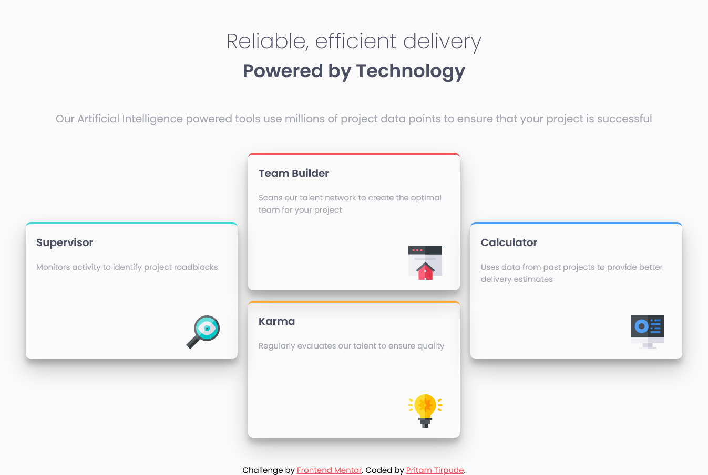

# Frontend Mentor - Four card feature section

## Table of contents

- [Overview](#overview)
  - [The challenge](#the-challenge)
  - [Screenshot](#screenshot)
  - [Links](#links)
- [My process](#my-process)
  - [Built with](#built-with)
  - [Useful resources](#useful-resources)
- [Author](#author)

## Overview

### The challenge

Users should be able to:

- View the optimal layout for the page depending on their device's screen size
- See hover states for all interactive elements on the page

### Solution Screenshot

### Links

- Solution URL: [Four Card Section Solution](https://www.frontendmentor.io/challenges/four-card-feature-section-weK1eFYK/hub/html-css-sass-flexbox-grid-MXgTlLYAV)
- Live Site URL: [Live Site](https://four-card-preview.netlify.app/)

## My process

### Built with

- Semantic HTML5 markup
- CSS custom properties
- Flexbox
- CSS Grid
- Mobile-first workflow

### Useful resources
- [Grid Positions](https://www.hongkiat.com/blog/moving-css-grid-items/) - This helped me for grid positioning. I really liked this pattern and will use it going forward.
- [Complete Grid Guide](https://css-tricks.com/snippets/css/complete-guide-grid/) - This article will clear all your doubts related to grid.

## Author

- Frontend Mentor - [@Pritam-Tirpude](https://www.frontendmentor.io/profile/Pritam-Tirpude)
- Twitter - [@ptirpude1991](https://twitter.com/ptirpude1991)
